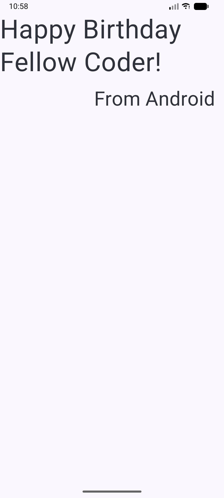
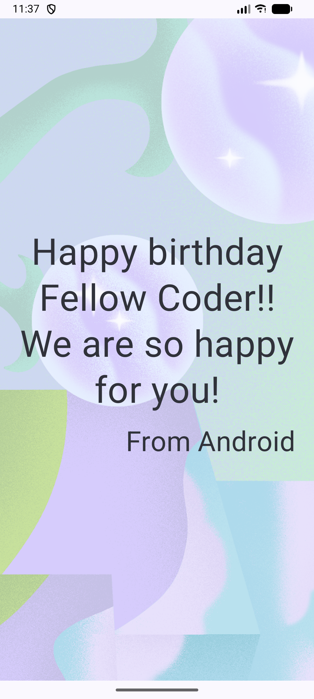
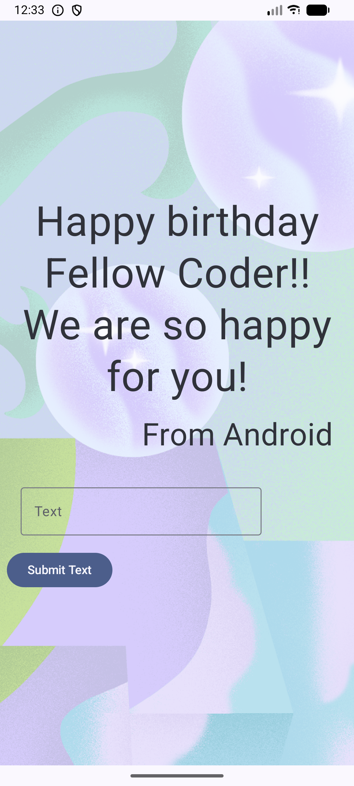
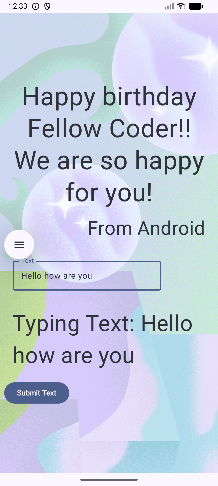
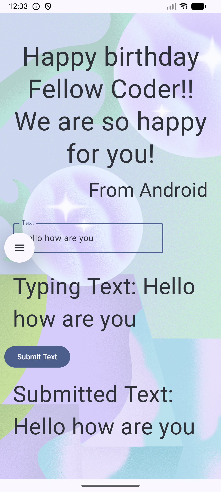
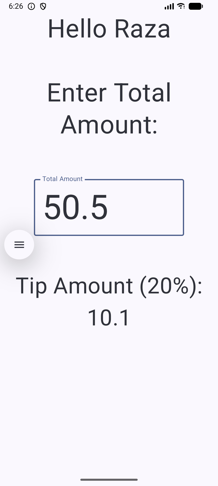
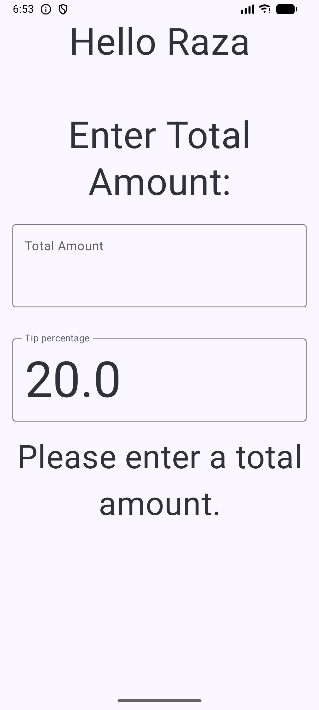
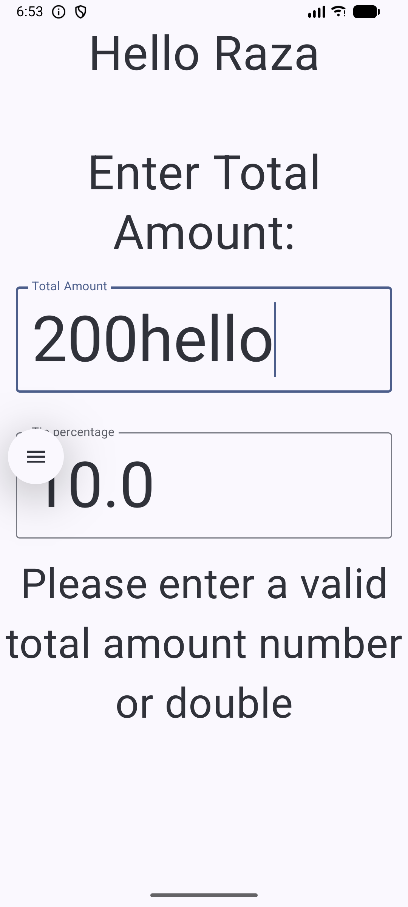
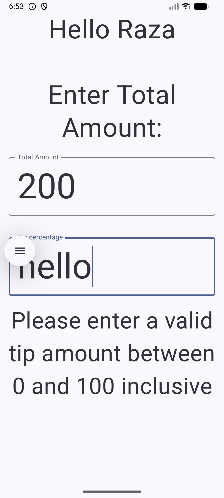
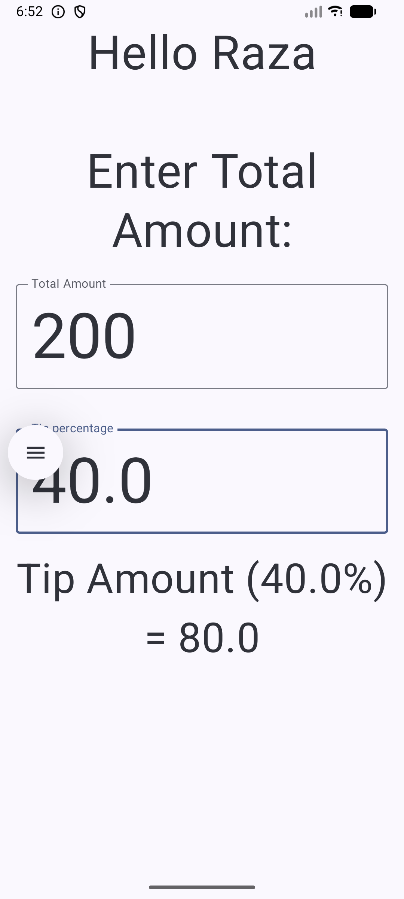

# Happy-Birthday-Android-App

App image and texts:

App input texts, capturing the input text in a remembered variable, adding
a button and capturing the input text in another remembered variable
when the submit button is clicked. The submitted text is then displayed
on the UI as well.
Quick Video Demo: https://screen.studio/share/AY2O7Td5?state=uploading

Tip calculator (calculates 20 percent tip):

Tip calculator with tip input plus input validation checks:

Tip calculator: Adding unit testing and instrumentation testing:
https://screen.studio/share/cDJiFb6s?state=uploading.